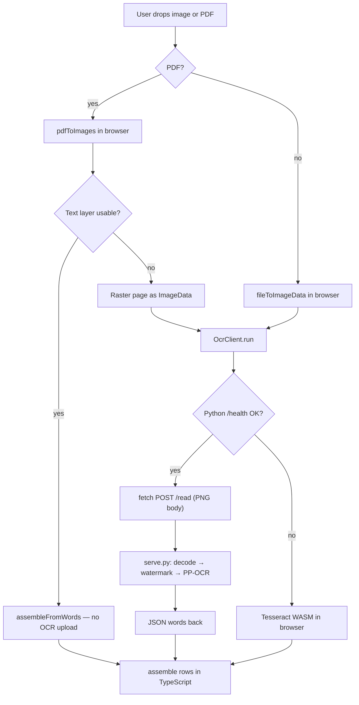

# How the Python reader and frontend work together

This guide explains what happens when you upload a receipt in the browser, when the Python server is involved, and how that differs from the CLI script `read_receipt.py`.

## Short summary

- The app **does** call a **local HTTP API** when the Python reader is running: `POST /read` with the page as **raw PNG bytes** (`Content-Type: image/png`). It is **not** multipart form upload and **not** a third-party cloud OCR service.
- The server is **`python/serve.py`** (default **127.0.0.1:8756**). In dev, Vite proxies `/read` and `/health` to that port.
- If the Python server is down, the app **falls back to Tesseract in the browser** (no upload).
- **`read_receipt.py`** is the same OCR core for **offline/CLI** use (read a file from disk, print JSON to stdout). The live UI uses **`serve.py`**.

---

## Two Python entry points

| Script | Purpose |
|--------|---------|
| `python/read_receipt.py` | Command-line tool: image path in → word-box JSON on stdout (scoring, batch runs). |
| `python/serve.py` | HTTP server for the React app: `GET /health`, `POST /read`. |

Both share the same pipeline:

1. Decode image (Pillow in `serve.py`, file load in CLI).
2. **Watermark suppression** — port of `frontend/src/ocr/receipt/color-watermark.ts`.
3. **PP-OCR** via `rapidocr-onnxruntime` (RapidOCR + ONNX).
4. Emit **`WordBox`** objects (text, x, y, width, height, confidence).

Neither script assembles receipt rows. Row/table building stays in TypeScript (`frontend/src/ocr/receipt/assemble.ts`) so both readers are scored and behave the same downstream.

---

## End-to-end flow in the UI



### 1. File pick (browser only)

`frontend/src/components/Dropzone.tsx` accepts **images** and **PDFs** (drag, paste, or file input). The file is read with normal browser APIs. Nothing hits the network until OCR runs.

### 2. PDF vs image

| Input | What happens |
|-------|----------------|
| **PDF with usable text layer** | Words come from the PDF in the browser. **Python is not called** for that page (`assembleFromWords` in `frontend/src/ocr/client.ts`). |
| **Scanned PDF** | Each page is rasterized to `ImageData`, then the same OCR path as a photo. |
| **Image (JPEG, PNG, …)** | Decoded to `ImageData`, then OCR. |

Session logic lives in `frontend/src/modules/app/useReceiptSession.ts`.

### 3. Default reader: Python

`frontend/src/ocr/types.ts` sets `reader: 'python'` by default.

`OcrClient` (`frontend/src/ocr/client.ts`):

1. On startup, calls **`GET /health`** (via `pythonReaderHealthy` in `frontend/src/ocr/python/reader.ts`).
2. For each page that needs OCR, calls **`readWithPython`**, which POSTs a PNG blob to **`/read`**.

Why PNG from `ImageData`, not the original file bytes:

- The app already holds a downscaled/decoded page in memory.
- PNG avoids extra JPEG artifacts on thin watermark strokes before Python’s own watermark pass.

### 4. Dev proxy

`frontend/vite.config.ts` forwards:

- `/health` → `http://127.0.0.1:8756`
- `/read` → `http://127.0.0.1:8756`

So the browser uses same-origin URLs; Vite sends them to `serve.py`.

Optional: set **`VITE_PYTHON_READER_URL`** (e.g. `http://192.168.1.10:8756`) when the API runs on another host. Trailing slashes are stripped.

### 5. Tesseract fallback

If `/health` fails, `OcrClient` loads **Tesseract** (WASM under `frontend/public/tesseract/`), runs watermark suppression in the browser, and **does not** POST to Python. The UI should show that Python was unavailable (reader name includes a fallback hint).

---

## What `serve.py` does on `POST /read`

Relevant behavior:

| Topic | Detail |
|-------|--------|
| Body | Raw image bytes; frontend sends PNG. Other formats work if Pillow can decode them. |
| Size limit | 40 MB (`MAX_UPLOAD_BYTES`). |
| Concurrency | One OCR at a time (`_read_lock`); up to 8 pending uploads (`MAX_PENDING_READS`), then **503** busy. |
| Disk | Receipts are processed **in memory**; the server does not write uploads to disk. |
| CORS | Allowed dev origins (localhost Vite/preview ports) or same-site when `--live` serves the built app. |
| Response JSON | `words`, `size`, `watermarkPixelRatio`, `elapsedMs` |

Processing steps inside the handler:

1. `decode_image(raw)` → RGB numpy array (Pillow).
2. `suppress_colored_watermark(rgb)` → greyscale page + pixel ratio.
3. `read_words(engine(), page, scale=2.0)` → PP-OCR word list.

Models load once on first use (`load_engine()` from `read_receipt.py`). Use `--warm` to load at startup.

### Running the server

```sh
# Dev (localhost only)
.venv/bin/python python/serve.py --warm

# Serve built frontend + API on all interfaces
.venv/bin/python python/serve.py --live --warm
```

Default bind: **127.0.0.1:8756** (dev). `--live` exposes the app and `/read` to the network; uploads are still processed on **this** machine.

---

## What `read_receipt.py` does (CLI)

For local benchmarks and `frontend/tools/score.test.ts`:

```sh
mkdir -p frontend/tools/out

.venv/bin/python python/read_receipt.py frontend/public/samples/weekly-invoice.jpg \
  > frontend/tools/out/weekly-invoice.jpg.words.json
```

Useful flags: `--no-suppress`, `--scales`, `--max-side`. See `python/README.md` for setup (Python 3.12 venv, OpenCV headless, excludes).

The CLI and `serve.py` call the same functions in `read_receipt.py`; only the I/O wrapper differs (file/stdout vs HTTP JSON).

---

## Key frontend files

| File | Role |
|------|------|
| `frontend/src/components/Dropzone.tsx` | Accept image/PDF |
| `frontend/src/modules/app/useReceiptSession.ts` | Upload session, PDF paging, call OCR |
| `frontend/src/ocr/client.ts` | Python vs Tesseract, watermark, assemble |
| `frontend/src/ocr/python/reader.ts` | `/health`, `/read` fetch |
| `frontend/vite.config.ts` | Proxy to Python in dev/preview |

## Key Python files

| File | Role |
|------|------|
| `python/serve.py` | HTTP `/health`, `/read` |
| `python/read_receipt.py` | OCR engine, watermark, word extraction |
| `python/README.md` | Install, scoring, why Python is outside the browser |

---

## Try it yourself

1. Start Python: `.venv/bin/python python/serve.py --warm` → wait for `ready`.
2. Start UI: `pnpm --dir frontend dev` → open the Vite URL.
3. Drop a **JPEG or PNG** → in DevTools **Network**, you should see **`POST /read`** (proxied to `:8756`).
4. Stop `serve.py` and upload again → OCR should still work via **Tesseract**, with a message that the Python reader is unavailable.

For a **text PDF**, you may see **no** `/read` request for pages that use the embedded text layer.

---

## Why Python exists at all

PP-OCR reads these lottery receipts more accurately than Tesseract on watermark-thinned print, but PP-OCR needs OpenCV. Running that in the browser blocked the main thread for minutes during OpenCV.js init, so the app posts the page to a local Python process instead. Details and benchmark tables are in `python/README.md`.
